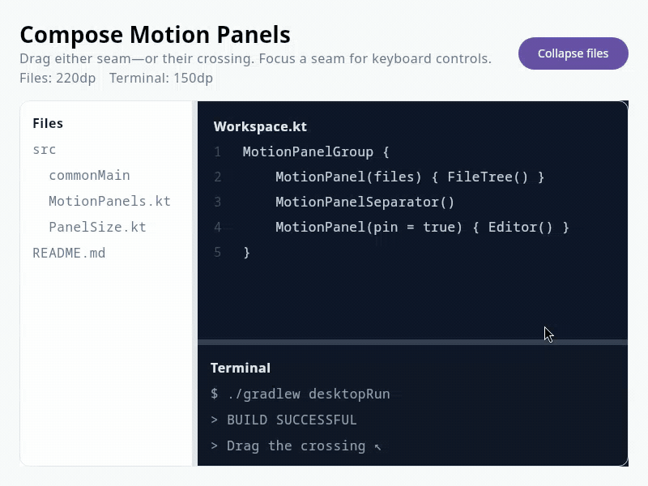
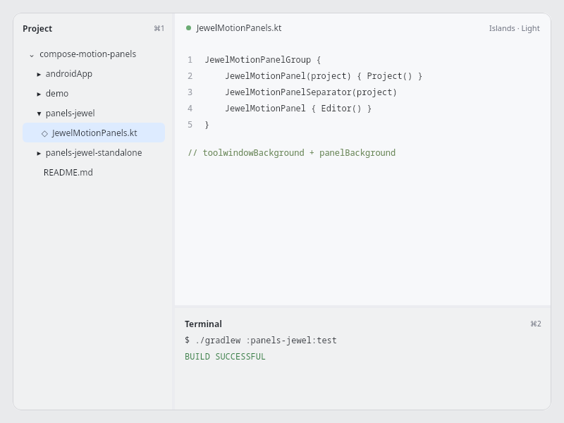
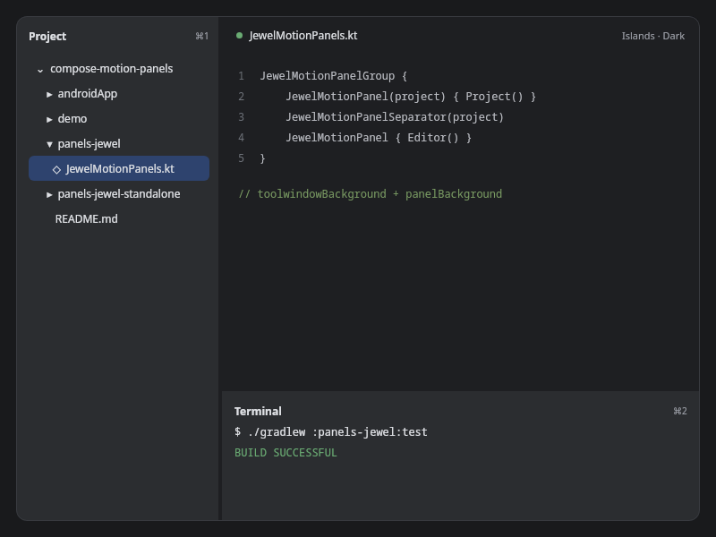

# Compose Motion Panels

A Compose Multiplatform port of [motion-panels](https://github.com/letstri/motion-panels),
targeting Android and desktop. It keeps the original interaction model while exposing Compose-native,
hoistable state and `Dp`/fraction sizing.

[Watch the desktop demo recording](docs/demo.mp4)



```kotlin
val files = rememberMotionPanelState(
    initialSize = 240.dp.panelSize,
    minSize = 160.dp.panelSize,
    maxSize = 420.dp.panelSize,
)

MotionPanelGroup {
    MotionPanel(files) { FileTree() }
    MotionPanelSeparator()
    MotionPanel(pin = true) { Editor() }
}
```

## Artifacts

The project is ready to publish under `io.github.rock3r`. Until the first release is published,
use a local checkout with `./gradlew publishToMavenLocal`.

```kotlin
// Android and regular Compose Desktop
implementation("io.github.rock3r:compose-motion-panels:<version>")
```

The core artifact has no Jewel dependency. Jewel support is desktop-only and split along Jewel's
runtime boundary:

| Use case | Artifact | Jewel runtime |
| --- | --- | --- |
| Standalone desktop app | `compose-motion-panels-jewel-standalone` | Brings `jewel-int-ui-standalone` |
| IntelliJ Platform plugin | `compose-motion-panels-jewel` | Uses Jewel bundled with the IDE |

Both expose the same `JewelMotionPanelGroup`, `JewelMotionPanel`, and
`JewelMotionPanelSeparator` API. Sized panels use `JewelTheme.globalColors.toolwindowBackground`;
the filling window uses `panelBackground`. Because standalone Jewel intentionally leaves the tool
window color unspecified, it falls back to `panelBackground` there.

### Jewel standalone

```kotlin
implementation("io.github.rock3r:compose-motion-panels-jewel-standalone:<version>")
```

Wrap the UI in Jewel's `IntUiTheme`, then use the Jewel-prefixed panel functions in exactly the
same way as the core API.

### IntelliJ Platform bridge / Islands themes

```kotlin
dependencies {
    implementation("io.github.rock3r:compose-motion-panels-jewel:<version>")

    intellijPlatform {
        bundledModule("intellij.platform.jewel.foundation")
        bundledModule("intellij.platform.jewel.ui")
        bundledModule("intellij.platform.jewel.ideLafBridge")
        bundledModule("intellij.libraries.compose.foundation.desktop")
        bundledModule("intellij.libraries.skiko")
    }
}
```

Use the API below a `SwingBridgeTheme`. The adapter reads the active IDE theme at composition
time, including Islands' tool-window and panel backgrounds. It deliberately declares Jewel as
`compileOnly`: IntelliJ 2025.1.2+ bundles Jewel, and shipping a private bridge/runtime copy is not
supported by Jewel.

| Islands Light | Islands Dark |
| --- | --- |
|  |  |

These representative palettes are rendered by the desktop visual test through the Jewel adapter.
Inside an IDE, the bridge supplies the exact `toolwindowBackground` and `panelBackground` values
from the active look and feel.

The build currently targets Compose Multiplatform 1.12 and Jewel 0.40. Jewel 0.40 artifacts are
compiled for Java 25, so Jewel consumers and the full repository build require JDK 25; the core
Compose Multiplatform artifact still targets JVM 11.

## Behavior

- Horizontal and vertical groups, including arbitrary nesting
- `Dp` and percentage sizes that preserve their unit after a resize
- Min/max bounds capped by the room left by the other panel
- Mouse, stylus, and touch dragging with the original 3 px pan threshold
- Drag-to-collapse below half of `minSize`; clipped 250 ms folds using the original easing
- Zero-layout-extent separators and automatic invisible edge grips
- Keyboard resize (arrows, Shift, Page Up/Down, Home/End, Enter, Escape)
- Double-click reset, RTL-aware horizontal dragging, and accessibility range semantics
- Pinned filling content during folds
- Simultaneous two-axis resizing where nested separator hit areas intersect

`MotionPanelGroup` intentionally follows the original structural rule: one filling panel (the panel
without state), plus at most one sized panel on each side. Nest another group for deeper layouts.

## Run

```shell
./gradlew :demo:run                 # desktop demo
./gradlew :androidApp:assembleDebug # Android demo (requires Android SDK 37)
./gradlew :panels:desktopTest       # state-machine tests
./gradlew :panels-jewel:test        # Jewel color mapping tests
./gradlew :demo:spectreTest         # live desktop E2E via https://spectre.sebastiano.dev
```

The Spectre test drives a real Compose Desktop window and verifies drag, keyboard resizing, collapse,
and reopening. On headless Linux, run it under `xvfb-run`.

## Publishing

Maven Central metadata, source/Javadoc jars, signing, and a tag/manual GitHub Actions release are
configured. See [PUBLISHING.md](PUBLISHING.md) for the one-time Central Portal and repository-secret
setup. Creating or pushing a `v*` tag publishes and releases that version, so do that only when the
release is intended.

## Attribution

This is an independent Kotlin/Compose port, not an official motion-panels project. The reference
implementation is Copyright © 2026 Valerii Strilets and MIT licensed; its notice is preserved in
[`LICENSES/motion-panels-MIT.txt`](LICENSES/motion-panels-MIT.txt).

## License

MIT © 2026 Sebastiano Poggi. See [LICENSE](LICENSE).
