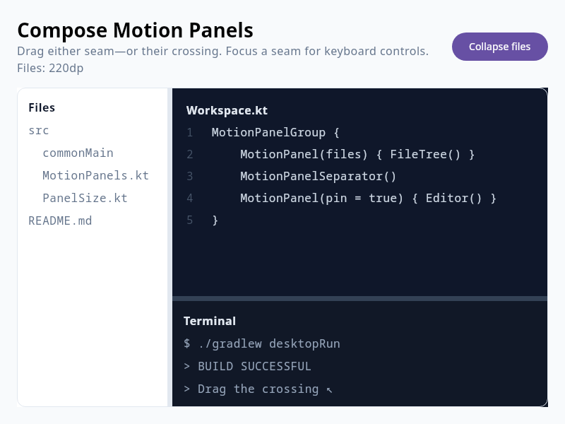

# Compose Motion Panels

A Compose Multiplatform port of [motion-panels](https://github.com/letstri/motion-panels),
targeting Android and desktop. It keeps the original interaction model while exposing Compose-native,
hoistable state and `Dp`/fraction sizing.



```kotlin
val files = rememberMotionPanelState(
    initialSize = 240.dp.panelSize,
    minSize = 160.dp.panelSize,
    maxSize = 420.dp.panelSize,
)

MotionPanelGroup {
    MotionPanel(files) { FileTree() }
    MotionPanelSeparator()
    MotionPanel(pin = true) { Editor() }
}
```

## Behavior

- Horizontal and vertical groups, including arbitrary nesting
- `Dp` and percentage sizes that preserve their unit after a resize
- Min/max bounds capped by the room left by the other panel
- Mouse, stylus, and touch dragging with the original 3 px pan threshold
- Drag-to-collapse below half of `minSize`; clipped 250 ms folds using the original easing
- Zero-layout-extent separators and automatic invisible edge grips
- Keyboard resize (arrows, Shift, Page Up/Down, Home/End, Enter, Escape)
- Double-click reset, RTL-aware horizontal dragging, and accessibility range semantics
- Pinned filling content during folds
- Simultaneous two-axis resizing where nested separator hit areas intersect

`MotionPanelGroup` intentionally follows the original structural rule: one filling panel (the panel
without state), plus at most one sized panel on each side. Nest another group for deeper layouts.

## Run

```shell
./gradlew :demo:run                 # desktop demo
./gradlew :androidApp:assembleDebug # Android demo (requires Android SDK 36)
./gradlew :panels:desktopTest       # state-machine tests
./gradlew :demo:spectreTest         # live desktop E2E via https://spectre.sebastiano.dev
```

The Spectre test drives a real Compose Desktop window and verifies drag, keyboard resizing, collapse,
and reopening. On headless Linux, run it under `xvfb-run`.

## Attribution

This is an independent Kotlin/Compose port, not an official motion-panels project. The reference
implementation is Copyright © 2026 Valerii Strilets and MIT licensed; its notice is preserved in
[`LICENSES/motion-panels-MIT.txt`](LICENSES/motion-panels-MIT.txt).

## License

MIT © 2026 Sebastiano Poggi. See [LICENSE](LICENSE).
